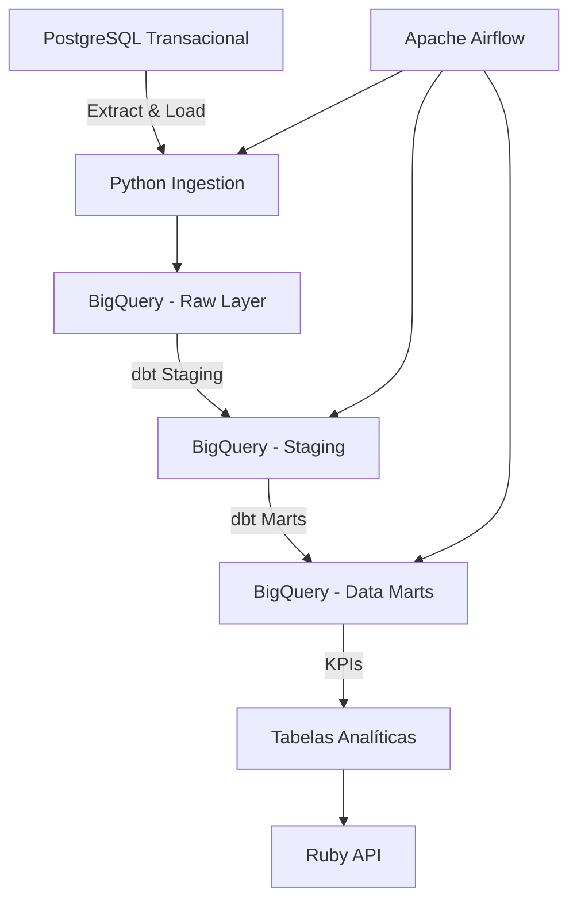
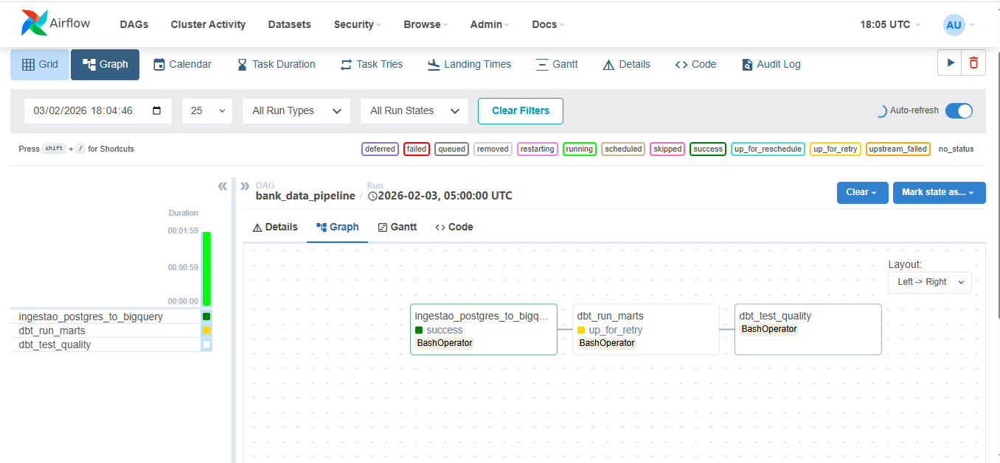
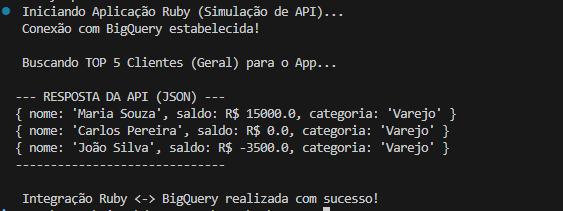
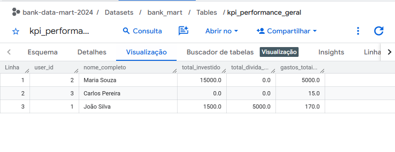

# End-to-End Bank Data Pipeline

Pipeline de Engenharia de Dados completo simulando um ambiente financeiro real, cobrindo todo o fluxo desde um banco transacional até a camada de consumo analítica.

O projeto vai de um PostgreSQL operacional até um dashboard executivo, passando por Data Lake no BigQuery, transformações com dbt, orquestração com Airflow e exposição dos dados por meio de uma API em Ruby.

---

## Visão Geral da Arquitetura



---

## Tech Stack

* Fonte: PostgreSQL (Docker)
* Ingestão: Python (Pandas, SQLAlchemy)
* Data Warehouse: Google BigQuery
* Transformação: dbt (Data Build Tool)
* Orquestração: Apache Airflow (Docker)
* Consumo: Ruby (simulacao de backend API)
* Infraestrutura: Docker e Docker Compose

---

## Arquitetura de Dados

1. Ingestão (Extract & Load)

   * Scripts em Python extraem dados de clientes, transações e empréstimos do PostgreSQL.
   * Os dados brutos sao carregados no BigQuery na camada `bank_raw`.

2. Transformação (Transform)

   * O dbt é responsavel pela modelagem analítica:

     * Staging: limpeza, padronização e tipagem dos dados.
     * Marts: construção de fatos e dimensões utilizando Star Schema.
     * KPIs: cálculo de métricas como saldo líquido, exposição ao risco e segmentação de clientes.

3. Orquestração

   * Uma DAG no Airflow executa diariamente o pipeline completo.
   * Dependências garantem a ordem correta: ingestão, testes de qualidade e transformações dbt.

4. Serving

   * Uma aplicação em Ruby consome os dados tratados diretamente do BigQuery.
   * A API simula o backend de um aplicativo bancário ou dashboard executivo.

---

## Como Executar o Projeto

### Pré-requisitos

* Docker e Docker Compose
* Conta no Google Cloud Platform com Service Account
* Python 3.8 ou superior

---

### Configuração do Ambiente

1. Clone o repositório.
2. Copie `.env.example` para `.env` e preencha com valores reais.
3. Adicione a credencial de Service Account do GCP em `secrets/gcp-sa.json` (somente para uso local).
4. Configure o SDK do Google Cloud localmente ou use `GOOGLE_APPLICATION_CREDENTIALS` via `.env`.
5. Gere `AIRFLOW_FERNET_KEY` (ex.: `python -c "from cryptography.fernet import Fernet; print(Fernet.generate_key().decode())"`).

---

### Infraestrutura (Airflow)

```bash
cd airflow_infra
docker-compose --env-file ../.env up -d --build
```

A interface do Airflow ficará disponível em:

```
http://localhost:8085
```

Credenciais de acesso:

* Definidas em `.env` (AIRFLOW_ADMIN_USER / AIRFLOW_ADMIN_PASSWORD)

---

### Execução do Pipeline

1. Acesse o Airflow.
2. Ative a DAG `bank_data_pipeline`.
3. O pipeline executará automaticamente a ingestão e as transformações dbt.

---

### Teste da Aplicação Ruby

Para simular o consumo dos dados analíticos:

```bash
cd ruby_app
docker build -t banco-ruby-api .
docker run --env-file ..\.env -v ${PWD}/..\secrets:/app/secrets:ro banco-ruby-api
```

---

## Resultados

O pipeline gera a tabela analítica `kpi_performance_geral`, permitindo segmentacao de clientes e analise financeira em tempo quase real.

Exemplo de resposta da API Ruby:

```json
{ "nome": "Maria S.", "saldo": 15000.0, "categoria": "Varejo" }
{ "nome": "Joao S.", "saldo": -3500.0, "categoria": "Varejo" }
```

---

### Evidências de Execução

### Pipeline Executado com Sucesso
Fluxo de orquestração completo no Airflow: da ingestão PostgreSQL à modelagem dbt


### Saída da API
Aplicação Ruby a consumir dados tratados do BigQuery via Google Client Library


### BigQuery Preview
Data Mart final no BigQuery pronto para consumo analítico


---

## Autor

Ricardo
Data Engineer
